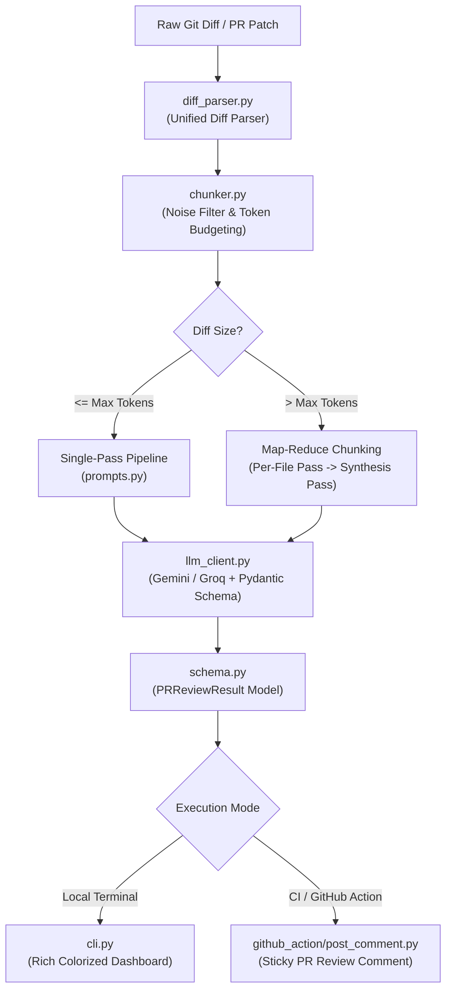

# 🤖 PR Explainer & Code Review Bot

An AI-powered Git diff reviewer and PR explainer bot that parses git diffs, produces high-signal plain-English summaries, flags architectural & security risks, and recommends concrete test cases.

Works seamlessly as a **local developer CLI tool** or as an automated **GitHub Action** that posts sticky reviews on Pull Requests.

---

## 🚀 Key Features

- **📝 Plain-English Executive Summary:** Explains what changed and *why*, in human-friendly engineering terms.
- **⚠️ Risk & Regression Detection:** Evaluates security hazards, breaking contract changes, concurrency issues, and unhandled failure modes.
- **🧪 Actionable Test Suggestions:** Generates concrete test scenarios with boundary conditions, edge cases, and rationale.
- **✂️ Intelligent Token Chunking & Noise Filtering:** Automatically filters out noisy lockfiles (`package-lock.json`, `poetry.lock`), minified assets, and test snapshots, partitioning large PRs into manageable LLM chunks.
- **🛡️ Strict Pydantic Schema Validation:** Validates all LLM responses against strict typed schemas, with automatic self-repair on parsing errors.
- **⚡ Multi-Provider Support:** First-class support for **Google Gemini** (Gemini 2.5 Flash / Pro) and **Groq** (Llama 3.3 70B).
- **📌 Dual-Mode Interface:**
  - **Local CLI:** Terminal dashboard with color-coded severity badges, tables, and JSON/Markdown export.
  - **GitHub Action:** Automated CI bot that updates a single "sticky" comment per PR or submits formal reviews.

---

## 🏛️ Architecture



---

## 📂 Repository Structure

```text
pr-explainer-bot/
├── src/
│   ├── diff_parser.py       # Parses raw diff/patch into structured per-file hunks & stats
│   ├── chunker.py           # Filters noise & partitions large diffs into LLM-sized chunks
│   ├── llm_client.py        # Wraps Gemini/Groq calls, handles JSON extraction & Pydantic validation
│   ├── prompts.py           # System prompts, single-pass & map-reduce synthesis templates
│   ├── schema.py            # Pydantic models for structured review output
│   └── reviewer.py          # Orchestrates parsing -> chunking -> LLM analysis -> markdown rendering
├── cli.py                   # Terminal CLI entry point
├── github_action/
│   ├── action.yml           # GitHub Action definition (composite action)
│   └── post_comment.py      # Formats JSON review as markdown and posts/updates GitHub PR comment
├── tests/
│   ├── sample_diffs/        # Sample diffs: small feature, risky auth change, large multi-file
│   └── test_reviewer.py     # Unit and integration test suite
├── .env.example             # Template for API keys and configuration
├── pyproject.toml           # Python package configuration and dependencies
└── README.md                # Project documentation
```

---

## 🛠️ Installation & Setup

### 1. Clone & Install Dependencies

```bash
git clone https://github.com/your-username/pr-explainer-bot.git
cd pr-explainer-bot

# Create and activate a virtual environment
python -m venv .venv
# Windows:
.venv\Scripts\activate
# Linux/macOS:
source .venv/bin/activate

# Install package and dependencies
pip install -e .
```

### 2. Configure Environment Variables

Copy `.env.example` to `.env`:

```bash
cp .env.example .env
```

Set your preferred provider and API key in `.env`:

```env
LLM_PROVIDER=gemini
GEMINI_API_KEY=your_gemini_api_key_here
GEMINI_MODEL=gemini-2.5-flash

# Or if using Groq:
# LLM_PROVIDER=groq
# GROQ_API_KEY=your_groq_api_key_here
# GROQ_MODEL=llama-3.3-70b-versatile
```

---

## 💻 CLI Usage

The CLI supports inspecting raw diff files, uncommitted changes, staged changes, or comparing branches.

### Review a Diff File
```bash
python cli.py review tests/sample_diffs/small_feature.diff
```

### Review Staged Changes (Before Committing)
```bash
python cli.py review --staged
```

### Review Current Branch Against Main
```bash
python cli.py review --branch main
```

### Pipe Directly from Git Diff
```bash
git diff HEAD~1 | python cli.py review -
```

### Export to Markdown or JSON
```bash
# Output formatted Markdown to a file
python cli.py review tests/sample_diffs/risky_auth_change.diff --format markdown --output review.md

# Output raw JSON for custom automation
python cli.py review tests/sample_diffs/large_multi_file.diff --format json --output review.json
```

---

## 🐙 GitHub Action Setup

Add the bot to your repository by creating `.github/workflows/pr-explainer.yml`:

```yaml
name: "PR Explainer Bot"

on:
  pull_request:
    types: [opened, synchronize, reopened]

permissions:
  contents: read
  pull-requests: write
  issues: write

jobs:
  review:
    runs-on: ubuntu-latest
    steps:
      - name: Checkout Code
        uses: actions/checkout@v4
        with:
          fetch-depth: 0

      - name: Run PR Explainer Bot
        uses: ./github_action
        with:
          github_token: ${{ secrets.GITHUB_TOKEN }}
          gemini_api_key: ${{ secrets.GEMINI_API_KEY }}
          provider: "gemini"
          comment_mode: "sticky" # Updates existing comment on new pushes
```

### Action Configuration Options

| Input | Description | Default |
|:---|:---|:---:|
| `github_token` | GitHub token for PR comments | `${{ github.token }}` |
| `gemini_api_key` | Google Gemini API key | `""` |
| `groq_api_key` | Groq API key | `""` |
| `provider` | `gemini` or `groq` | `gemini` |
| `model` | Specific model override | `""` |
| `comment_mode` | `sticky` (update comment), `new` (new comment), `review` (formal PR review) | `sticky` |

---

## 🧪 Running Tests

Run the test suite using `pytest`:

```bash
pytest -v
```

All parser, chunker, schema, and mocked reviewer tests run without needing an active API key.

---

## 📋 Sample Output Preview

```markdown
## 🤖 PR Review: Add Discount Calculation Utility

**Verdict:** 🟢 **APPROVE**  |  **Confidence:** 98%  |  **Est. Review Time:** ~3 min

### 📝 Executive Summary
Introduces a new `calculate_discount` helper function in `src/math_utils.py` that computes the discounted price from a base amount and percentage. Adds comprehensive input validation rejecting negative prices and percentage ranges outside 0-100.

### 🏗️ Architectural Impact
Minimal; self-contained utility function with no new dependencies.

### 🔑 Key Changes
- Added `calculate_discount(price, discount_percent)` function
- Added input validation for negative numbers and percentages > 100
- Added unit tests covering typical cases and boundary violations

### ⚠️ Identified Risks & Regressions
✅ *No major security, architectural, or regression risks flagged.*

### 🧪 Recommended Tests
- **[UNIT]** `calculate_discount`: Test floating-point precision on fractional discounts (e.g. 33.33%)
- **[UNIT]** `calculate_discount`: Verify behavior when price is 0.0

<details>
<summary><b>📂 File-by-File Breakdown (2 files)</b></summary>

| File | Change | Diff Stats | Summary |
|:---|:---:|:---:|:---|
| `src/math_utils.py` | MODIFIED | `+7/-0` | Added calculate_discount helper |
| `tests/test_math_utils.py` | ADDED | `+11/-0` | Added unit tests for discount function |

</details>

---
*Generated with automated PR Explainer Bot powered by Gemini / Groq.*
```
